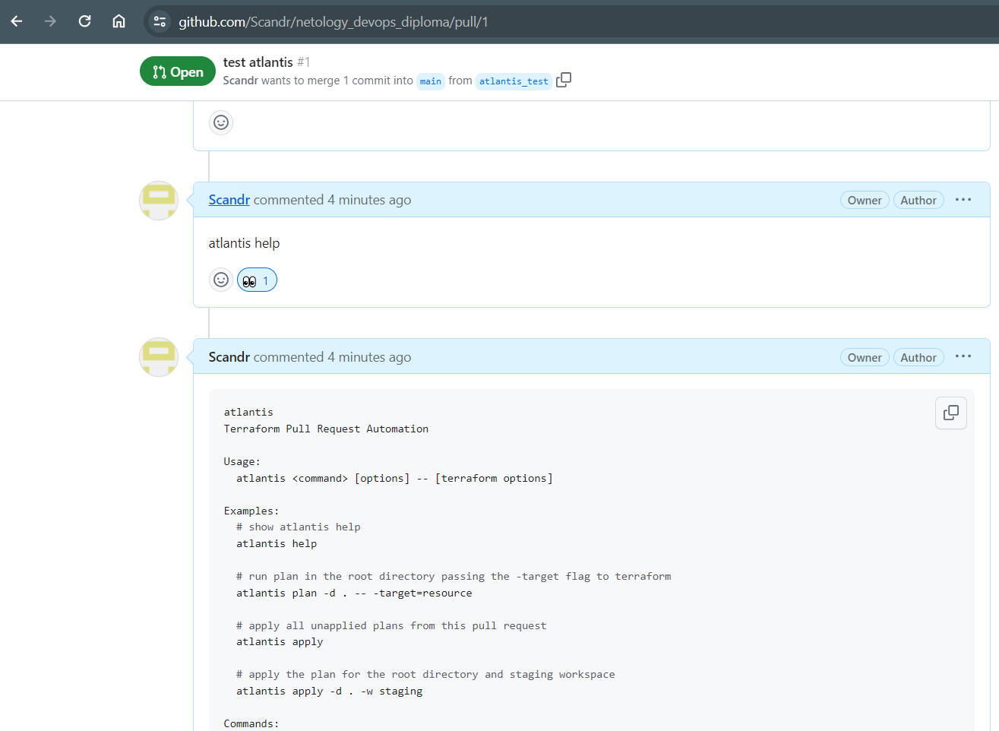
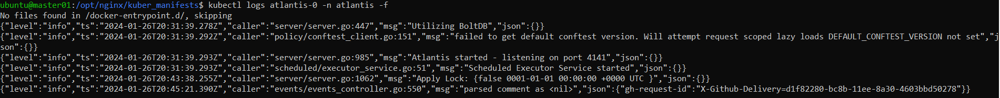
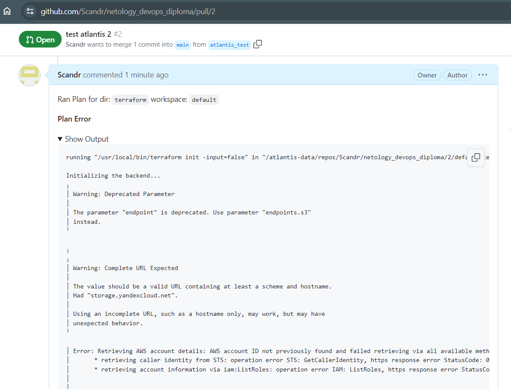

# Task
## Что необходимо для сдачи задания?

#### 1. Репозиторий с конфигурационными файлами Terraform и готовность продемонстрировать создание всех ресурсов с нуля.
##### Ответ: [netology_devops_diploma.git](https://github.com/Scandr/netology_devops_diploma.git)<br>
#### 2. Пример pull request с комментариями созданными atlantis'ом или снимки экрана из Terraform Cloud или вашего CI-CD-terraform pipeline.
##### Ответ: [atlantis_source.git](https://github.com/Scandr/atlantis_source.git)
~~??? делать через неспецифичный для terraform CI-CD (Jenkins)? Есть подозрение, что не работает Atlantis с YC~~<br>
#### 3. Репозиторий с конфигурацией ansible, если был выбран способ создания Kubernetes кластера при помощи ansible.
##### Ответ: [netology_devops_diploma.git](https://github.com/Scandr/netology_devops_diploma.git)<br>
#### 4. Репозиторий с Dockerfile тестового приложения и ссылка на собранный docker image.
##### Ответ: 
[nginx_cicd_source.git](https://github.com/Scandr/nginx_cicd_source.git)<br>
[xillah/nginx](https://hub.docker.com/repository/docker/xillah/nginx/general)<br>
#### 5. Репозиторий с конфигурацией Kubernetes кластера.
##### Ответ: ???
Сборка кластера в плейбуках: [netology_devops_diploma.git](https://github.com/Scandr/netology_devops_diploma.git)<br>
Манифесты для приложения: [nginx_cicd_source.git](https://github.com/Scandr/nginx_cicd_source.git)<br>
#### 6. Ссылка на тестовое приложение и веб интерфейс Grafana с данными доступа.
##### Ответ: Оно должно постоянно работать или можно назначить время? <br>
#### 7. Все репозитории рекомендуется хранить на одном ресурсе (github, gitlab)


# Set up Terraform
Place file key.json in terraform/ directory. File can be generated with command:
```
yc iam key create --service-account-name default-sa --output key.json --folder-id <folder ID>
```
Fill access_key and secret_key in terraform/provider.tf with your values using command:
```
$ yc iam access-key create --service-account-name terraform
```
Service account terraform must already exist
<br>
# Set up Ansible
Ansible must be installed on the terraform host 
<br>
Create secret file playbooks/group_vars/secrets.yml for atlantis installation with content:
```
gh_user: "my_git_user"
gh_token: "my_git_token"
gh_webhook_secret: "my_webhook_secret"
```
# Run infrastructure installation
On terraform+ansible host run from this_git_repo/terraform folder: 
```
terraform plan
terraform apply
```
This should deploy VMs with terraform and install Kubernetes with ansible playbooks on them, then nfs serve, jenkins, prometheus and atlantis should be installed in the cluster
<br>

And in the end of the output - list of created VM IPs:
```
Apply complete! Resources: 10 added, 0 changed, 0 destroyed.

Outputs:

external_ip_address_node00 = "51.250.27.61"
external_ip_address_node01 = "84.201.139.147"
external_ip_address_node02 = "84.201.138.49"
internal_ip_address_node00 = "192.168.20.20"
internal_ip_address_node01 = "192.168.20.21"
internal_ip_address_node02 = "192.168.20.22"
```
external_ip_address_node00 is the external address of the master node of the cluster. All web resource should be available at this IP with the proper port
<br>
## Cluster access
### kube config
Admin kube config should appear in folder this_git_repo/kube_config/node0/etc/kubernetes. To make it valid replace server ip with external master node IP (example: 51.250.27.61)

### Jenkins
After installation is complete, find jenkins info in ansible output. There should be host, port and admin password like that:
```
null_resource.cluster (local-exec): TASK [Echo jenkins_chart_output] ***********************************************
null_resource.cluster (local-exec): ok: [node0] => {}
null_resource.cluster (local-exec):
null_resource.cluster (local-exec): MSG:
null_resource.cluster (local-exec):
null_resource.cluster (local-exec): ["Jenkins node: ['Node:             worker01/192.168.20.21']", "Jenkins port: ['31027']", "Jenkins admin password: ['s6jOECmJksIpIpb5FHF9AX']"]
```
Jenkins should be available by link: http://external_master_node_IP:jenkins_port
<br>
Example: http://51.250.27.61:31027
<br>
Login is admin. Password is acquired from the ansible output
<br>
Further setup in [nginx_cicd_source](https://github.com/Scandr/nginx_cicd_source) 
### Grafana
Login to the master node or use local kubectl with kubeconfig. There I used ubuntu image with my key, created during one of the previous tasks:
```
$ ssh -i /opt/yandex_cloud/id_rsa ubuntu@51.250.27.61
```
Use port forwarding to get grafana UI:
```
kubectl port-forward grafana-599d66f74-4xzlt 3000:3000 --address 0.0.0.0 -n monitoring
```
Use port forwarding to get promethues UI:
```
kubectl port-forward prometheus-k8s-0 9090:9090 --address 0.0.0.0 -n monitoring
```
# Atlantis testing
Run command to show help
```
atlantis help
```

<br>
Atlantis log output:
```
{"level":"info","ts":"2024-01-26T20:45:21.390Z","caller":"events/events_controller.go:550","msg":"parsed comment as <nil>","json":{"gh-request-id":"X-Github-Delivery=d1f82280-bc8b-11ee-8a30-4603bbd50278"}}
```

<br>
It seems not to be working with yandex Cloud:<br>

<br>


<details>

<summary>Full log message:</summary>

```
running "/usr/local/bin/terraform init -input=false" in "/atlantis-data/repos/Scandr/netology_devops_diploma/2/default/terraform": exit status 1

Initializing the backend...
╷
│ Warning: Deprecated Parameter
│ 
│ The parameter "endpoint" is deprecated. Use parameter "endpoints.s3"
│ instead.
╵

╷
╷
│ Warning: Complete URL Expected
│ 
│ The value should be a valid URL containing at least a scheme and hostname.
│ Had "storage.yandexcloud.net".
│ 
│ Using an incomplete URL, such as a hostname only, may work, but may have
│ unexpected behavior.
╵

│ Error: Retrieving AWS account details: AWS account ID not previously found and failed retrieving via all available methods. See https://www.terraform.io/docs/providers/aws/index.html#skip_requesting_account_id for workaround and implications. Errors: 2 errors occurred:
│ 	* retrieving caller identity from STS: operation error STS: GetCallerIdentity, https response error StatusCode: 0, RequestID: , request send failed, Post "https://sts.ru-central.amazonaws.com/": dial tcp: lookup sts.ru-central.amazonaws.com on 10.96.0.10:53: no such host
│ 	* retrieving account information via iam:ListRoles: operation error IAM: ListRoles, https response error StatusCode: 403, RequestID: 82ee24f8-5713-425c-bb15-9ae465089ddb, api error InvalidClientTokenId: The security token included in the request is invalid.
│ 
│ 
│ 
│ 
╵

```

</details>

Not sure if it can be fixed